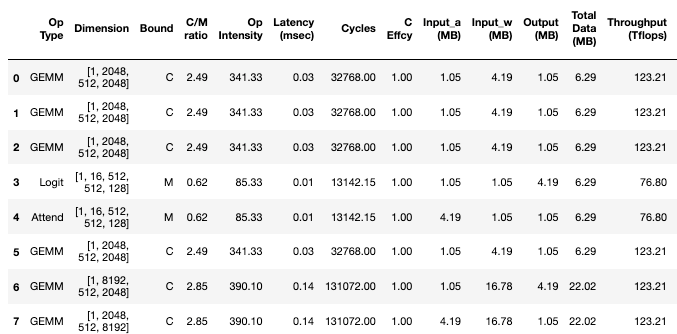
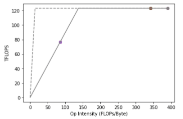

# Roofline Model for DNN Workload and Accelerator 
This is a roofline cost model for DNN accelerators. We support CNNs, MLPs, and Transformers workload.

# What it does
* Given DNN accelerator system information (using the `System` class in `src/system.py`), where you can specify PE array shape (mxu_shape), on-chip BWs, off-chip BWs, etcs.
* Given DNN workload (e.g., `model='vgg16'`)

RAGS (using `get_model_df()`) generate a table of layer-wise latency and memory usage information as well as a roofline figure, as shown in the following



# How to use it
You are welcome to play with it by ``notebook/dnn_accel_playground.ipynb``.

### Plug into you experiments
Please use the ``analyze_model``. The paramaeters of it can be found in the following.
```python
model_df, _ = analyze_model()
```
``model_df`` contains a layer-by-layer analysis results. 

# Algorithmic Parameters
### Basic Parameters
* use_attn_model: Set to True if you want to use the pre-defined attention-based language model configuration that we provide.
* attn_model: We proivide three sets of confiuration:``BERT``, ``XLA``, ``TrXL``.
* custom_model: If you don't want to use the pre-defined bert model
  1. Set ``use_bert_model`` to False 
    2. Set ``custom_model`` to ``custom``
   3.  Create a ``custom.csv`` model configuration in ``data/model``. You can use ``data/model/alexnet.csv`` as an template.
* batch_size: Batch size
### Sparsity-specific Parameters
* custom_sparsity: Set to False if
    1. you would not like to explore sparsity or 
    2. if you would like to explore uniform sparsity on all the layers, i.e., all the layers have density defined by the following three parameters ``density_input``, ``density_weight``, ``density_output``.
    * if you set ``custom_sparsty`` to False, you can specify you customized layer-by-layer sparsity in ``data/sparsity/custom.csv`` (assuming you model is named ``custom``)

* density_input: Density of input tensor. Set to 1.0 if considering dense.
* density_weight: Density of weight tensor. Set to 1.0 if considering dense.
* density_output: Density of output tensor. Set to 1.0 if considering dense.
* compress_mem: Set to True, if you want to model the fact of memory saving when model has sparsity. If set to False, then it would model the fact that model is saved in un-compressed format.
* skip_compute: Set to True, if you want to model the fact of compute saving (by skipping 0 multiplication) when model has sparsity. If set to False, then it would model the fact that all the 0-multiplications are executed.
* skip_compute_on_noopt_output: Set to True, if you want to model a more clever control which skip to computation when knowing the output is going to be ignored anyway. This would be effective when we are sparsifying the operation with masking the output. That is if we know the output is going to be masked anyway, we skip the computation.
### Attention model-specific Parameter
* attn_method: The attention method. You can choose from ``vanilla``, ``sparse`` (sparse transformer-like), ``lowrank`` (Linformer-like), ``kernel`` (Performer-like).
* low_rank_ratio: The low rank projection ratio, if you pick ``lowrank`` method.
* spattn_density: Sparse attention density, if you pick ``sparse`` method.
* m_ratio: The kernel approximation projection ratio, if you pick ``kernel`` method.
* seq_len: Sequence length.
# System Parameters
* onchip_mem_bw: On-chip memory bandwidth (GB/s)
* offchip_mem_bw: Off-chip memory bandwidth (GB/s)
* flops: The compute capacity. Number of floating point operation per seconds. (TFLOPs/s)
* frequency: The frequency of the system. (MHz/s)
* bits: The bits per elements: Can choose from ``int8``,``bg16``, ``f32``
* compute_efficiency: The efficiency of the compute unit. Default as 1.0.
* memory_efficiency: The efficiency of the memory accesss. Default as 1.0.
* use_flops: Set to True, if you want to use ``flops`` to indicate the compute capacity. Then this will consider the ideal case. If you want to explore the impact of the shape of the PE (processing elements) array, then set ``use_flops`` to False and specfiy the PE array shape by the following parameters.
* mxu_height: Height of PE array.
* mxu_width: Width of PE array.
* mxu_instance: Number of PE arrays.
    * These three parameters will creste ``mxu_instance`` of PE arrays. Each PE array has``mxu_height`` x ``mxu_width`` PEs. 


